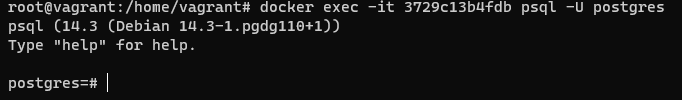

1. Установил докер
2. Выполнил команду
3. Строчки вывелись

4. Размер 13.3Kb (docker image list)

5. Посмотрел с помощью команды\
```docker ps```
6. Выполнил команду
7. Контейнер работает

8. Вернулся
9. Погулял
10. Создал\

11. Вышел
12. Выполнил
13. Папки нет
14. Мы не пробрасывали Volume, поэтому ничего не сохранилось
15. Запустил

16. Подключился

17. Создал таблицу

18. Остановил, удалил
19. Запустил
20. Таблицы нет
21. Всё по тем же причинам, что мы не пробрасывали Volume
22. Остановил